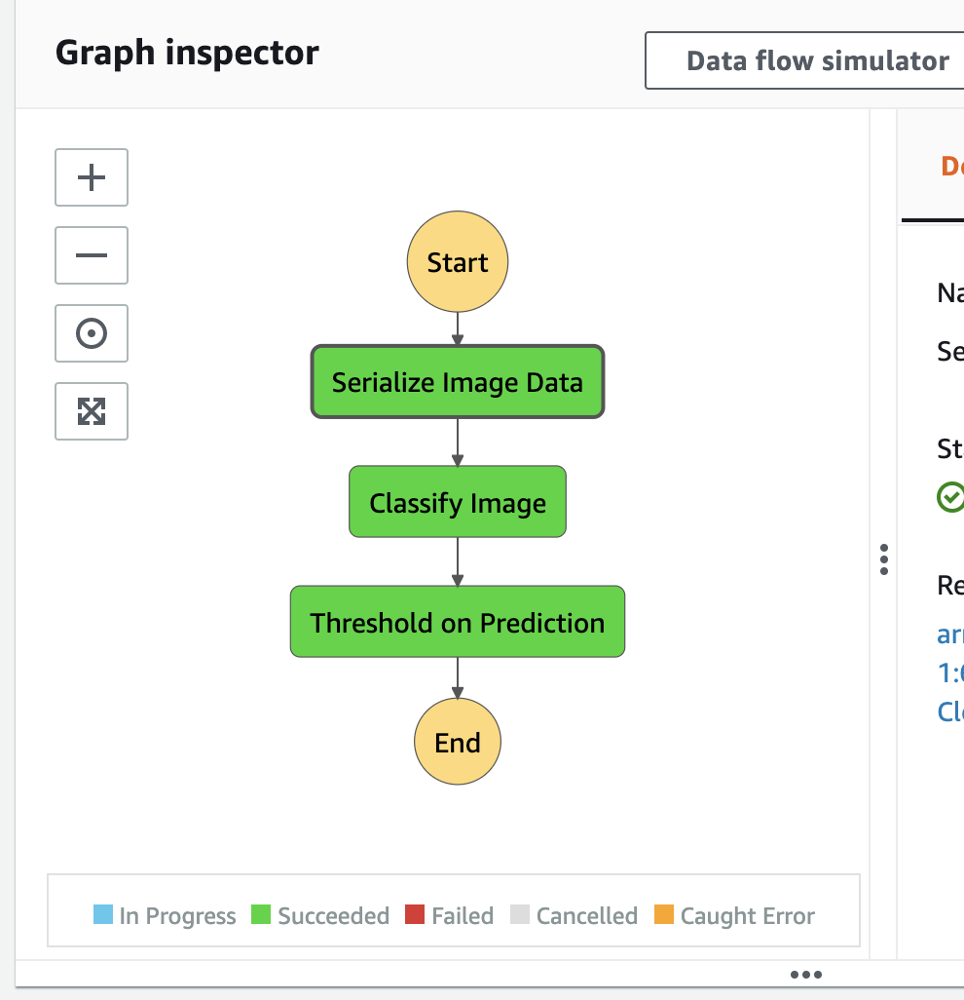
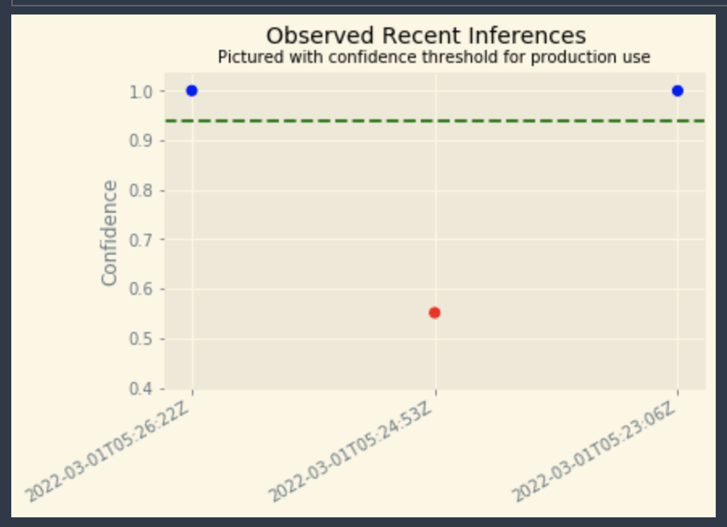

# Developing-ML-Workflow
This is the Github repo for my ML workflow.

In this project, I built and composed a scalable, ML-enabled, AWS application. I used AWS Sagemaker to build an image classification model that can tell bicycles apart from motorcycles. I then deployed the model, used AWS Lambda functions to build supporting services, and AWS Step Functions to compose my model and services into an event-driven application.

This project is split into several stages:

- Data Staging
- Model training and Deployment
- Lambdas and Step Function Workflow
- Testing and Evaluation

### Data Staging
The first step was to extract the data from the hosting service. Once the data was downloaded, I explored it and transformed it into the correct shape and format. Finally, I loaded the data to S3.

### Model training and Deployment
In this step, I used a AWS build-in image classification algorithm to train the model. Once the model was successfully trained, I deployed it to an endpoint and configured Model Monitor to track the deployment. At the end, I made an inference to test the model endpoint.

### Lambdas and Step Function Workflow
In this step, I wrote and deployed three Lambda functions, and then used the Step Functions visual editor to chain them together.

The first lambda function was responsible for data generation. The second one was responsible for image classification. And the third function was responsible for filtering out low-confidence inferences.

See below for a screenshot of the working step function:

### Testing and Evaluation
In this step, I first performed several step function invokations using data from the test dataset. This process gave me confidence that the workflow both succeeded AND failed as expected (i.e. low-confidence inferences failed as expected). In addition, I used the captured data from SageMaker Model Monitor to create a visualization to monitor the model as seen below.

